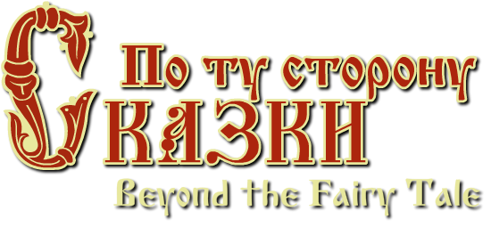

# По ту сторону сказки / Beyond the fairy tale

----
## Что тут у нас?

Частица игры на движке [Defold](https://www.defold.com/). 
Первоначально разрабатывалась для [GamesJamDefold](http://gamesjam.org/3008/). Позже была доработана для [Defold GDC Competition](https://forum.defold.com/t/defold-gdc-competition-2017-the-winning-games/4481).

Помимо "джемовой" сущности проекта, также стоит принять во внимание, что игра писалась на Defold'е образца начала 2017. В связи с чем, кроме некоторых морально устаревших решений, тут не исключены "несовместимости" с текущими версиями движка, например:

* **кастомные материалы**. Что-то поменялось, и теперь некоторые материалы/шейдеры делают не совсем то, что делали ранее. Из-за чего могут встречаться графические артефакты. *Что заметил поправил, но не исключено, что что-то еще вылезет*.
* **порядок отображения/текст**. Раньше с этим делом было не сладко, и приходилось городить знатные костыли. [Увы, но не все эти костыли прошли проверку временем](https://prnt.sc/jepljp). Что именно сломалось проверить не успел.

----
## Поиграть
Последние публичные версии:

* [RUS](http://aterim.github.io/html5/skazka_rusdemo/) *(частичный, без вычитки)*
* [ENG](http://aterim.github.io/html5/skazka/)

* [Defold Community](https://www.defold.com/community/projects/40372/)

## Арт
[Подборка арта по проекту](https://www.artstation.com/artwork/oNbym)

----
## Авторы

* [Арт](https://vk.com/markmits)
* [Анимация](https://vk.com/look1982)
* [Музыка](https://vk.com/id2040533)
* [Код, сценарий и все остальное](https://vk.com/karikatygra)

----
## License

Code:

Other (art/music):

